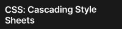
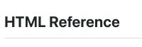

# Challenge Week 1

## Description
Here I used existing code from the client to take the their needs and adjust the code accordingly. This project was build to take client's needs and translate that into updated code on the current website. This project solves some functionality issues on the client website and updates the current code on the .html and .css files using semantic code with appropriate commenting. Here I was able to gain a glimpseof what it is like debug existing code and locate opportunities for improved readability and flow.

## Table of Contents
- [Website Preview](#website-preview)
- [Credits](#credits)
    - [CSS Information](#css-information)
    - [CSSBox Information](#cssbox-information)
    - [Git Cheat Sheet](#git-cheat-sheet)
    - [Git Flow Process](#git-flow-process)
    - [HTML References](#html-reference-guide)
    - [Markdown Language](#markdown-language-cheat-sheet)
- [License](#license)

## Website Preview

[Horiseon Website](https://esbev.github.io/challenge-week-1/)

## Credits
NOTE: Click on the thumbnail to view source

### CSS Information

### CSSBox Information

### Git Cheat Sheet

### Git Flow process

### HTML Reference Guide

### Markdown Language Cheat Sheet

## License

MIT License

Copyright (c) 2023 Eric

Permission is hereby granted, free of charge, to any person obtaining a copy
of this software and associated documentation files (the "Software"), to deal
in the Software without restriction, including without limitation the rights
to use, copy, modify, merge, publish, distribute, sublicense, and/or sell
copies of the Software, and to permit persons to whom the Software is
furnished to do so, subject to the following conditions:

The above copyright notice and this permission notice shall be included in all
copies or substantial portions of the Software.

THE SOFTWARE IS PROVIDED "AS IS", WITHOUT WARRANTY OF ANY KIND, EXPRESS OR
IMPLIED, INCLUDING BUT NOT LIMITED TO THE WARRANTIES OF MERCHANTABILITY,
FITNESS FOR A PARTICULAR PURPOSE AND NONINFRINGEMENT. IN NO EVENT SHALL THE
AUTHORS OR COPYRIGHT HOLDERS BE LIABLE FOR ANY CLAIM, DAMAGES OR OTHER
LIABILITY, WHETHER IN AN ACTION OF CONTRACT, TORT OR OTHERWISE, ARISING FROM,
OUT OF OR IN CONNECTION WITH THE SOFTWARE OR THE USE OR OTHER DEALINGS IN THE
SOFTWARE.